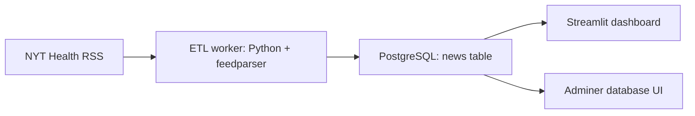

# Architecture

## System Overview

## Services

| Service | Role | Port |
|---|---|---|
| `db` | PostgreSQL database storing fetched news records | `5432` |
| `etl_worker` | Python container that fetches RSS entries and writes them to PostgreSQL | n/a |
| `dashboard` | Streamlit web app for viewing collected news | `8501` |
| `adminer` | Database inspection UI | `8080` |

## Data Flow

1. `etl_worker` reads the NYT Health RSS feed.
2. It extracts article title, link, published date, and source.
3. It writes records to the `news` table in PostgreSQL.
4. `dashboard` queries PostgreSQL and displays the records in Streamlit.
5. `adminer` can be used to inspect the database directly.

## Current Schema

| Field | Meaning |
|---|---|
| `title` | Article title |
| `link` | Article URL |
| `published` | RSS publication timestamp as provided by source |
| `source` | Source label, currently `NYT Health` |

## Production Gaps

- Add a stable article ID or URL hash.
- Add deduplication.
- Add ingestion timestamps.
- Normalize timestamps to UTC.
- Add source metadata.
- Add topic classification.
- Add scheduled jobs or a workflow orchestrator.

