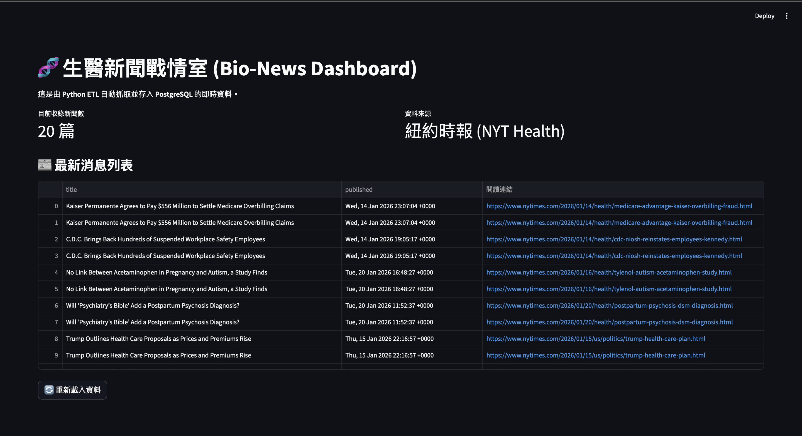

# 🧬 Bio-News Dashboard (生醫新聞戰情室)

這是一個自動化數據管線專案，使用 **Python**, **Docker** 與 **PostgreSQL** 建構。
自動抓取紐約時報 (NYT Health) RSS，並透過 Streamlit 進行視覺化展示。

## �� 成果展示 (Dashboard)


## 🛠️ 技術架構 (Tech Stack)
* **Infrastructure**: Docker, Docker Compose
* **Database**: PostgreSQL 15
* **ETL**: Python (Pandas, SQLAlchemy, Feedparser)
* **Frontend**: Streamlit
* **Orchestration**: Microservices Architecture

## 🚀 如何執行 (How to Run)
1. Clone 此專案
2. 執行指令：
   ```bash
   docker-compose up -d --build

