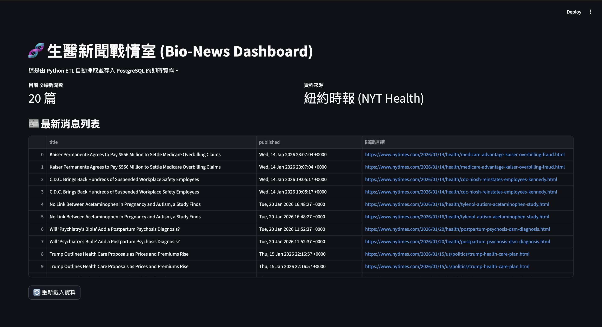

# Biomedical News Intelligence Dashboard

A lightweight public-signal monitoring prototype for biomedical and health news.

This project uses a small Dockerized data pipeline to collect public RSS news, store it in PostgreSQL, and display the latest records in a Streamlit dashboard. The current implementation tracks the New York Times Health RSS feed as a minimal, reproducible source. The broader portfolio framing is biomedical intelligence: turning scattered public information into a structured monitoring workflow.



## Why This Matters

Biomedical and biotech research move through scattered public signals: news, company updates, trial readouts, FDA announcements, journal publications, and partnerships. A useful monitoring system should make those signals easier to collect, review, and later classify.

This repo is an MVP of that workflow:

```text
public source
-> ETL worker
-> PostgreSQL evidence store
-> Streamlit dashboard
-> research monitoring workflow
```

## Current Scope

The current version is intentionally narrow:

- Source: NYT Health RSS
- ETL: fetch latest RSS entries with Python
- Storage: append records to PostgreSQL
- Dashboard: Streamlit table with source count, publication time, and article links
- Infrastructure: Docker Compose with database, ETL worker, dashboard, and Adminer

This is not yet a full biotech intelligence platform. It is a reproducible prototype showing the core data-product pattern.

## Tech Stack

- Python
- Pandas
- Feedparser
- SQLAlchemy
- PostgreSQL 15
- Streamlit
- Docker / Docker Compose
- Adminer for database inspection

## Repository Structure

```text
.
├── dashboard/
│   ├── app.py
│   ├── Dockerfile
│   └── requirements.txt
├── etl/
│   ├── main.py
│   ├── Dockerfile
│   └── requirements.txt
├── ARCHITECTURE.md
├── docker-compose.yaml
├── .env.example
├── screenshot.png
└── README.md
```

## How To Run

1. Clone the repository.

2. Optional: create a `.env` file from `.env.example`.

3. Start the full stack:

```bash
docker-compose up -d --build
```

4. Open the dashboard:

```text
http://localhost:8501
```

5. Open Adminer if you want to inspect PostgreSQL:

```text
http://localhost:8080
```

Default local database settings are defined in `docker-compose.yaml` and can be overridden with `.env`.

## What The Dashboard Shows

- Number of collected articles
- Current source label
- Latest news table
- Publication time
- Article link
- Manual reload button

## Design Choices

- The project uses Docker Compose so the app can run without local PostgreSQL setup.
- The ETL worker and dashboard are separated to mirror a production data-product pattern.
- PostgreSQL is used even though the dataset is small because the goal is to show a persistent evidence store, not just an in-memory demo.
- Adminer is included for transparent inspection of the underlying database.

## Limitations

- The RSS source is currently limited to NYT Health.
- The ETL job appends rows and does not yet deduplicate repeated articles.
- There is no topic classification, entity extraction, or alerting yet.
- The dashboard is a prototype and not a production monitoring system.
- The current source is general health news, not a specialized clinical-trials or FDA feed.

## Next Improvements

The most valuable next steps would be:

- Add source deduplication by article URL.
- Add more biomedical sources, such as FDA press releases, NIH news, company IR feeds, journals, and ClinicalTrials.gov updates.
- Add topic tags such as oncology, infectious disease, devices, FDA, trial readout, financing, partnership, and safety.
- Add entity extraction for company names, drugs, diseases, and trial identifiers.
- Add a source-quality field and evidence table export.
- Add a scheduled ETL run instead of a one-time container startup job.
- Add keyword alerts for selected therapeutic areas.

## Portfolio Interpretation

This project is best understood as a biomedical public-signal data product prototype. It complements research memo projects by showing the same workflow in application form:

```text
source discipline
-> data pipeline
-> structured evidence store
-> interface for monitoring
-> future intelligence layer
```
